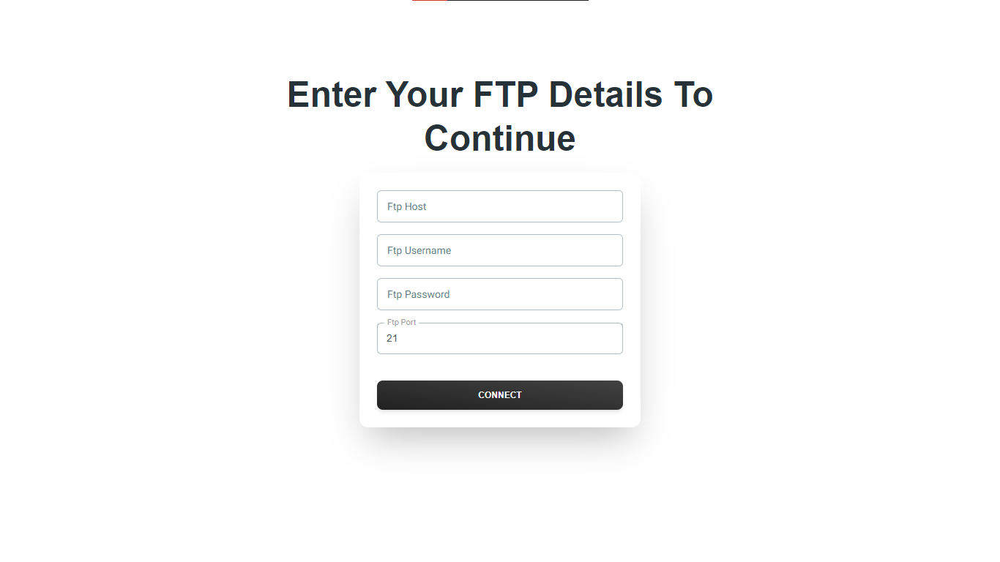
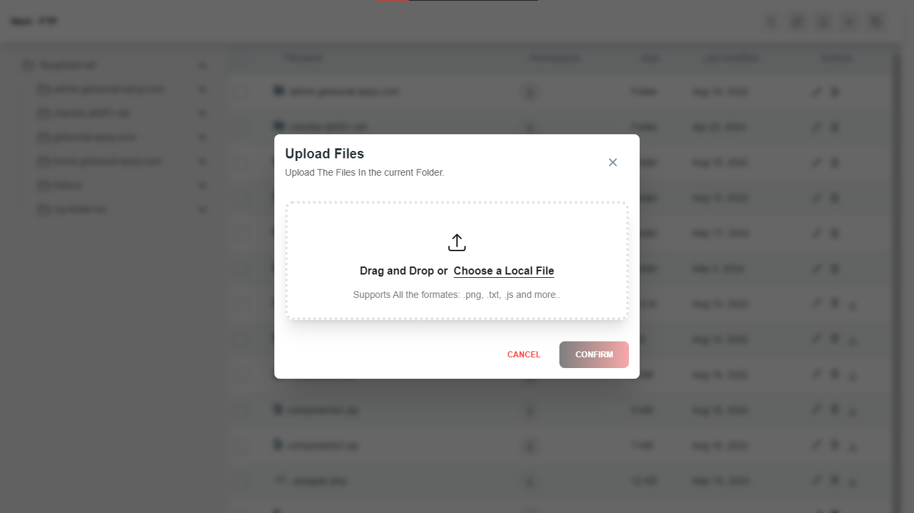
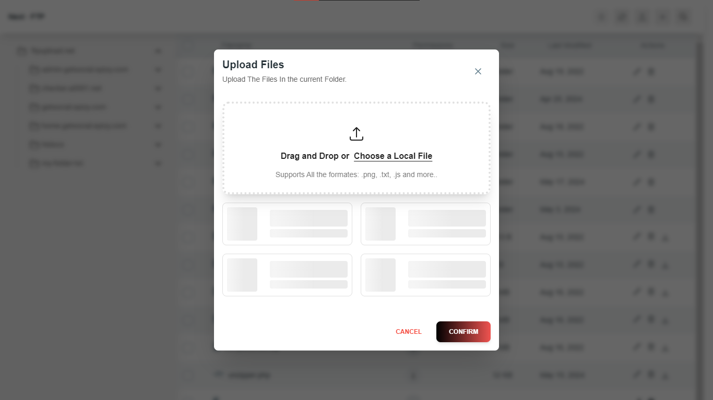

## Getting Started

To get started, run the following command to start the development server:

```sh
npm run dev

# NextJS & Tailwind Online FTP Client
 [](https://github.com/creativetimofficial/nextjs-tailwind-blog-posts-page/issues?q=is%3Aopen+is%3Aissue) [](https://github.com/creativetimofficial/nextjs-tailwind-blog-posts-page/issues?q=is%3Aissue+is%3Aclosed)

## Encrypted Ftp Login System With Crypto JS




